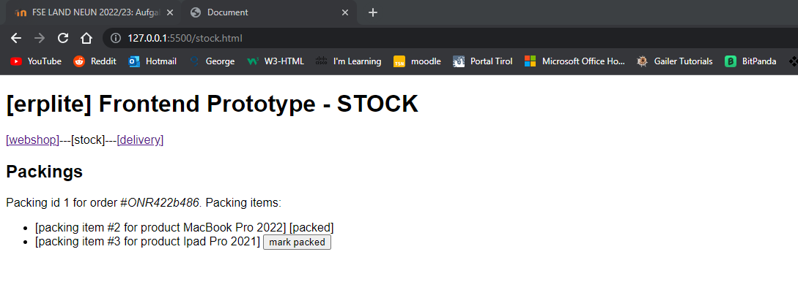

# FSE_LAND_Makroarchitektur

## Aufgabe Makroarchitektur Teil 1
## Theorie: Recherchiere zu folgenden Fragestellungen und fasse deine Erkenntnisse übersichtlich und illustrativ zusammen!

#
### Was ist Sofwarearchitektur?
Die Dokumentation der Softwarearchitektur ist von großer Bedeutung, um das Verständnis, die Kommunikation und die Weiterentwicklung der Software zu erleichtern. Es gibt verschiedene Methoden und Werkzeuge, die für die Dokumentation der Softwarearchitektur verwendet werden können. Hier sind einige gängige Ansätze:

-   Architekturbeschreibungen: Schriftliche Beschreibungen sind eine der grundlegenden Möglichkeiten, um die Softwarearchitektur zu dokumentieren. Es können Textdokumente erstellt werden, die die Architekturprinzipien, die Funktionalitäten der verschiedenen Komponenten, die Interaktionen zwischen den Komponenten und andere relevante Informationen erklären.

-   UML-Diagramme: Die Unified Modeling Language (UML) bietet eine Reihe von Diagrammtypen, die verwendet werden können, um die Softwarearchitektur zu visualisieren. Dazu gehören Klassendiagramme, Sequenzdiagramme, Paketdiagramme, Aktivitätsdiagramme usw. Diese Diagramme können die Struktur, die Beziehungen und das Verhalten der Komponenten veranschaulichen.

-   Architektur-Canvas: Ein Architektur-Canvas ist ein visuelles Modell, das eine Zusammenfassung der wichtigsten Architekturaspekte bietet. Es enthält Felder oder Abschnitte, in denen Informationen zu den Hauptkomponenten, den Interaktionen zwischen ihnen, den Schnittstellen, den Datenflüssen und den Designentscheidungen festgehalten werden können.

-   Code-Kommentare: Eine andere Möglichkeit, die Softwarearchitektur zu dokumentieren, besteht darin, Kommentare im Quellcode zu verwenden. Dies ermöglicht es den Entwicklern, wichtige Designentscheidungen, Abhängigkeiten zwischen Modulen und andere relevante Informationen direkt im Code zu erfassen.

Es ist wichtig, eine angemessene Balance zwischen detaillierter Dokumentation und leicht verständlichen Informationen zu finden. Die gewählte Methode hängt von den Anforderungen des Projekts, der Zielgruppe und den Präferenzen des Entwicklungsteams ab. Oftmals wird eine Kombination verschiedener Ansätze verwendet, um ein umfassendes Bild der Softwarearchitektur zu vermitteln.

#
### Wie kann man Softwarearchitektur dokumentieren?
Die Dokumentation der Softwarearchitektur kann auf verschiedene Weisen erfolgen. Hier sind einige Ansätze zur Dokumentation der Softwarearchitektur:

-   Architekturbeschreibungen: Verfassen Sie schriftliche Beschreibungen, um die Softwarearchitektur zu dokumentieren. Dies kann in Form von Textdokumenten, Architekturübersichten oder Architekturbeschreibungen erfolgen. Beschreiben Sie die grundlegenden Konzepte, Komponenten, deren Funktionen und Beziehungen zueinander.

-   Diagramme: Verwenden Sie visuelle Diagramme, um die Softwarearchitektur zu veranschaulichen. UML-Diagramme (Unified Modeling Language) wie Klassendiagramme, Komponentendiagramme, Sequenzdiagramme und Aktivitätsdiagramme sind gängige Methoden, um die Struktur, Interaktionen und Abläufe der Softwarearchitektur darzustellen.

-   Architekturmodelle: Erstellen Sie Modelle, die die Softwarearchitektur auf abstrakterer Ebene beschreiben. Architekturmodelle können verschiedene Perspektiven wie Logikschicht, Datenflüsse, Komponenteninteraktionen und Datenstrukturen umfassen. Sie dienen dazu, das Verständnis der Architektur zu erleichtern und Entscheidungen zu unterstützen.

-   Prototypen und Proof-of-Concepts: Erstellen Sie funktionierende Prototypen oder Proof-of-Concepts, um die Softwarearchitektur zu veranschaulichen und wichtige Aspekte zu demonstrieren. Dies kann dazu beitragen, das Verständnis der Architektur zu verbessern und potenzielle Herausforderungen frühzeitig zu erkennen.

-   Dokumentationstools: Nutzen Sie spezialisierte Tools oder Softwarearchitektur-Frameworks, die eine strukturierte Dokumentation ermöglichen. Diese Tools bieten oft vorgefertigte Vorlagen, um Diagramme zu erstellen, und unterstützen die Zusammenarbeit im Team.

-   Inline-Kommentare: Fügen Sie innerhalb des Quellcodes der Softwarearchitektur relevante Inline-Kommentare hinzu. Diese Kommentare können wichtige Entscheidungen, Abhängigkeiten oder Designprinzipien erläutern und das Verständnis der Architektur beim Lesen des Codes verbessern.

Es ist wichtig, dass die Dokumentation kontinuierlich aktualisiert und gepflegt wird, um den Entwicklern und Stakeholdern stets eine aktuelle und verständliche Übersicht über die Softwarearchitektur zu bieten.

#
### Welches sind die wichtigsten Eigenschaften von Langlebigen Softwarearchitekturen (Lilienthal)
Carola Lilienthal hat in ihrem Buch "Langlebige Softwarearchitekturen" einige wichtige Eigenschaften von Softwarearchitekturen identifiziert, die zu ihrer Langlebigkeit beitragen können. Hier sind einige dieser Eigenschaften:

-   Modularität: Eine langlebige Softwarearchitektur ist modular aufgebaut, sodass einzelne Komponenten unabhängig voneinander entwickelt, getestet und gewartet werden können. Dies ermöglicht eine hohe Flexibilität und erleichtert Änderungen in der Software.

-   Klare Abstraktionen: Die Architektur sollte klare Abstraktionen verwenden, um komplexe Systeme in überschaubare Module zu unterteilen. Dadurch wird die Komplexität reduziert und das Verständnis der Architektur erleichtert.

-   Lose Kopplung: Eine langlebige Softwarearchitektur zeichnet sich durch eine geringe Kopplung zwischen den einzelnen Komponenten aus. Dadurch können Änderungen in einer Komponente durchgeführt werden, ohne dass dies große Auswirkungen auf andere Teile des Systems hat.

-   Hohe Kohäsion: Die Komponenten einer langlebigen Softwarearchitektur sollten stark zusammengehörige Funktionen bündeln. Dadurch wird die Lesbarkeit, Wartbarkeit und Testbarkeit verbessert.

-   Erweiterbarkeit: Eine langlebige Softwarearchitektur sollte es ermöglichen, das System einfach zu erweitern, um neue Anforderungen zu erfüllen. Dies kann durch den Einsatz von Schnittstellen und Erweiterungspunkten erreicht werden.

-   Testbarkeit: Eine gute Testbarkeit ist eine wichtige Eigenschaft von langlebigen Softwarearchitekturen. Durch klare Abgrenzungen zwischen den Modulen und die Verwendung von automatisierten Tests kann die Stabilität und Qualität des Systems gewährleistet werden.

-   Dokumentation: Eine umfassende und aktuelle Dokumentation ist entscheidend, um das Verständnis der Softwarearchitektur langfristig aufrechtzuerhalten. Die Dokumentation sollte sowohl die Designentscheidungen als auch die Schnittstellen und Abhängigkeiten des Systems umfassen.

Diese Eigenschaften tragen dazu bei, dass eine Softwarearchitektur langlebig ist und Änderungen und Weiterentwicklungen effizient und nachhaltig unterstützt.

#
### Was ist ein Modulith?
Ein Modulith ist ein Begriff, der in der Softwarearchitektur verwendet wird und eine spezielle Art von Softwaremodul beschreibt, das sowohl die Vorteile von monolithischen Architekturen als auch von modular aufgebauten Architekturen kombiniert.

Im Kontext von Softwarearchitektur bezieht sich der Begriff "Modulith" auf eine Monolith-Architektur, bei der die internen Komponenten und Module klar voneinander abgegrenzt und nach bestimmten Designprinzipien organisiert sind. Im Gegensatz zu einer traditionellen monolithischen Architektur, in der alle Funktionen und Komponenten in einem einzigen großen Codebase zusammengefasst sind, ermöglicht der Modulith eine logische Unterteilung des Codes in mehrere Module.

Ein Modulith verwendet oft Module oder Domänen als organisatorische Einheiten, um verwandte Funktionen und Verantwortlichkeiten zusammenzufassen. Diese Module können intern weitere Untermodule oder Komponenten enthalten. Jedes Modul ist jedoch Teil eines einzigen, integrierten Builds und wird als zusammenhängende Einheit bereitgestellt.

Der Modulith-Ansatz ermöglicht es, die Vorteile eines monolithischen Ansatzes beizubehalten, wie z.B. einfacheres Deployment, leichtere Datenzugriffe zwischen Modulen und eine gemeinsame Codebasis. Gleichzeitig erlaubt er eine klarere Trennung von Verantwortlichkeiten und eine bessere Modularität, was die Wartbarkeit und Erweiterbarkeit der Architektur verbessert.

Es ist wichtig anzumerken, dass der Begriff "Modulith" kein allgemein anerkannter Begriff ist und keine einheitliche Definition hat. Die genaue Ausgestaltung eines Moduliths kann je nach Kontext, Anforderungen und Präferenzen variieren.

#
### Wie funktioniert die Ports and Adapters Architektur?
Die Ports and Adapters Architektur, auch bekannt als Hexagonal Architecture oder Onion Architecture, ist ein Architekturmuster, das darauf abzielt, die Geschäftslogik einer Anwendung von externen Abhängigkeiten und Infrastrukturdetails zu entkoppeln.

Diese Architektur ermöglicht eine klare Trennung der Verantwortlichkeiten und eine bessere Testbarkeit der einzelnen Komponenten. Die externe Infrastruktur wird durch Ports und Adapter isoliert, wodurch die Geschäftslogik unabhängig von spezifischen Technologien oder Frameworks bleibt. Dadurch wird die Flexibilität und Austauschbarkeit der Komponenten erleichtert und die Gesamtarchitektur wird robuster und besser wartbar.

Die Ports and Adapters Architektur besteht aus drei Kernkonzepten:

-   Ports: Ports sind Schnittstellen oder Verträge, die die Interaktion zwischen der Geschäftslogik und der Außenwelt definieren. Es gibt zwei Arten von Ports:

    - Inbound Ports (Eingangsports): Diese Ports ermöglichen den Zugriff auf die Geschäftslogik von externen Komponenten wie Benutzerschnittstellen, APIs oder Event-Streams. Sie definieren die erwarteten Eingabeoperationen, über die die externen Komponenten mit der Geschäftslogik interagieren können.

    - Outbound Ports (Ausgangsports): Diese Ports ermöglichen der Geschäftslogik den Zugriff auf externe Ressourcen wie Datenbanken, Dateisysteme oder externe Services. Sie definieren die erwarteten Ausgabeoperationen, über die die Geschäftslogik mit den externen Ressourcen kommunizieren kann.

-   Adapters: Adapters sind Implementierungen der Ports, die die eigentliche Kommunikation zwischen der Geschäftslogik und den externen Komponenten oder Ressourcen ermöglichen. Sie sind für die Anpassung der Kommunikationsschnittstellen verantwortlich, um die Interaktion zwischen den verschiedenen Schichten zu erleichtern. Es gibt zwei Arten von Adaptern:

    - Inbound Adapter: Dieser Adapter implementiert den Eingangsport und ermöglicht die Übersetzung von externen Anfragen oder Ereignissen in Formate und Aktionen, die von der Geschäftslogik verstanden werden.

    - Outbound Adapter: Dieser Adapter implementiert den Ausgangsport und bietet die spezifischen Implementierungen für die Kommunikation mit externen Ressourcen. Er stellt sicher, dass die Anfragen der Geschäftslogik an die externen Ressourcen weitergeleitet und die entsprechenden Ergebnisse zurückgegeben werden.

- Geschäftslogik: Die eigentliche Geschäftslogik der Anwendung wird in der Kernschicht implementiert. Diese Schicht enthält alle domänespezifischen Regeln und Operationen, die von den Ports und Adapters verwendet werden.


#
### DDD: Was sind die wesentlichen Bausteine des modellgetriebenen Entwurfs (Taktische Pattern) aus DDD?
Im modellgetriebenen Entwurf (taktische Patterns) der Domain-Driven Design (DDD) Architektur gibt es mehrere wesentliche Bausteine, die dabei helfen, komplexe Domänenmodelle zu erstellen und zu organisieren. Diese Bausteine sind:

-   Entity (Entität): Eine Entität repräsentiert ein Objekt mit einer eindeutigen Identität. Sie hat Zustand und Verhalten, und Änderungen an einer Entität werden im Kontext der Domäne verfolgt. Entitäten werden häufig über ihre Identität identifiziert und können über die Zeit hinweg verändert werden.

-   Value Object (Wertobjekt): Ein Wertobjekt repräsentiert einen konzeptuellen Wert innerhalb der Domäne, der keine eigene Identität hat. Wertobjekte sind unveränderlich (immutable) und werden meist für Eigenschaften oder Attribute verwendet, die zusammengehören und als Einheit behandelt werden sollten.

-   Aggregate: Ein Aggregate ist eine Gruppierung von verwandten Entitäten und Wertobjekten. Es stellt eine konsistente Einheit dar, bei der eine spezifische Entität als Wurzel des Aggregats fungiert. Das Aggregat definiert Regeln und Invarianten, um die Konsistenz der darin enthaltenen Entitäten und Wertobjekte sicherzustellen.

- Domain Event (Domänenereignis): Ein Domain Event ist etwas, das in der Domäne passiert und von Bedeutung ist. Es wird oft verwendet, um zustandsändernde Ereignisse zu modellieren, die für das Geschäft relevant sind.


-   Repository: Ein Repository stellt einen Mechanismus zum Zugriff auf und zur Persistenz von Entitäten und Aggregaten bereit. Es bietet Methoden zum Abfragen, Ändern und Speichern von Objekten in einer bestimmten Domäne.

-   Service: Ein Service ist eine operationale Einheit, die Domänenlogik enthält und Aktionen ausführt, die nicht natürlicherweise in eine einzelne Entität oder ein Aggregate passen. Services unterstützen komplexe Geschäftsprozesse und koordinieren die Zusammenarbeit zwischen verschiedenen Entitäten und Aggregaten.

-   Factory: Eine Factory ist eine Komponente, die die Erstellung von komplexen Objekten oder Aggregaten vereinfacht. Sie ist verantwortlich für die Erstellung und Konfiguration neuer Instanzen und kann komplexe Initialisierungslogik oder Datenzusammenstellung enthalten.

Diese Bausteine des modellgetriebenen Entwurfs in DDD werden verwendet, um die Komplexität der Domäne zu bewältigen und eine klarere Organisation und Strukturierung des Domänenmodells zu ermöglichen. Indem sie die Sprache der Domäne in den Code übersetzen, helfen sie dabei, ein besser verständliches, wartbares und erweiterbares Software-Design zu schaffen.

#
#
## Abgabe der Architekturanalyse des bestehenden erplite-Backends

#
### Dokumentation (textuelle Beschreibung, Codeauszüge, C4-Diagramme, Klassendiagramme) der Ports-Und-Adapters-Architektur und der DDD-Bestandteile (taktische Muster) von Ordermanagement anhand der gegebenen Anwendungsfälle, die schon implementiert sind:

#


Das Programm läuft unter einer in-memory H2 Datenbank und ist in 3 Hauptmodule unterteilt:
- Customermanagement
- Ordermanagement
- Stockmanagement

Außerdem gibt es noch einen Shared Kernel, der als DDD Modul dient.
Es werden von ihm Funktionen bereitgestellt, die von allen 3 Hauptmodulen verwendet werden.

### DDD-Bestandteile Ordermanagement:
- Entity: Die Klasse Order ist in unserem Beispiel eine Entität.


    
- Value Objects: 


- Domain Events:


- Service/Application Layer:


- Infrastructure Layer:

Die db- und messaging.spring-Pakete stellen den Infrastructure Layer dar.


- Interfaces (Ports):


- Adapters:


##   Bestellung aufgeben

Es wird eine neue Bestellung über einen HTTP POST Request auf die Ordermanagement API abgesetzt.

```java
@PostMapping("/orders/")
    public ResponseEntity placeNewOrder(@RequestBody @Valid PlaceOrderCommand placeOrderCommand, BindingResult bindingResult) {

        Logger.getLogger(this.getClass().getName()).log(Level.INFO, "Handling place new order api request ...");

        HashMap<String, String> errors = new HashMap<>();

        if (bindingResult.hasErrors()) {
            Logger.getLogger(this.getClass().getName()).log(Level.WARNING, "Errors in placeOrderCommand detected!");
            for (FieldError fieldError : bindingResult.getFieldErrors()) {
                errors.put(fieldError.getField(), fieldError.getDefaultMessage());
            }
            throw new OrderPlacedFieldValidationException("Validation errors for order placement!", errors);
        }

        OrderResponse orderResponse = orderCommandService.handle(placeOrderCommand);

        String resourceLocation = ServletUriComponentsBuilder.fromCurrentContextPath().build().toUriString() + "/orders/" + orderResponse.orderID();
        try {
            return ResponseEntity.created(new URI(resourceLocation)).body(orderResponse);
        } catch (URISyntaxException e) {
            return ResponseEntity.noContent().build();
        }
    }
```
Nachdem eine Bestellung erfolgreich war, wird eine neue Order Response erstellt. Hierbei wird die handle() Methode der Port-Klasse OrderCommandService aufgerufen. Der dazugehörige Adapter OderCommandServiceImpl springt an und es wird die Methode handle(PlaceOrderCommand) aufgerufen.

```java
    @Transactional
    public OrderResponse handle(PlaceOrderCommand placeOrderCommand) {
        Logger.getLogger(this.getClass().getName()).log(Level.INFO, "Handle place order command ...");
        List<String> errors = validatePlaceOrderCommand(placeOrderCommand);
        if (errors.size() != 0) throw new OrderDataValidationException(errors);

        List<LineItem> lineItemList = new ArrayList<>();
        int i = 1;
        for (CartItem cartItem : placeOrderCommand.cartItems()) {
            lineItemList.add(new LineItem(
                            new OrderPosition(i),
                            new ProductNumber(cartItem.productNumber()),
                            new Name(cartItem.productName()),
                            new MonetaryAmount(new BigDecimal(cartItem.priceNet())),
                            new Percentage(cartItem.tax()),
                            new Amount(cartItem.amount())
                    )
            );
            i++;
        }

        Order orderToInsert = new Order(
                new OrderID("ONR" + UUID.randomUUID().toString().substring(0, 7)),
                new CustomerData(
                        new CustomerID(placeOrderCommand.customerID()),
                        new Name(placeOrderCommand.customerFirstname()),
                        new Name(placeOrderCommand.customerLastname()),
                        new Email(placeOrderCommand.customerEmail()),
                        placeOrderCommand.customerStreet(),
                        placeOrderCommand.customerZipcode(),
                        placeOrderCommand.customerCity(),
                        placeOrderCommand.customerCountry()
                ),
                LocalDateTime.now(),
                lineItemList,
                OrderState.PLACED
        );

        Logger.getLogger(this.getClass().getName()).log(Level.INFO, "Insert new order in DB ...");
        Optional<Order> orderOptional = this.orderRepository.insert(orderToInsert);

        if (orderOptional.isPresent()) {
            Logger.getLogger(this.getClass().getName()).log(Level.INFO, "Publishing order placed domain event ...");
            orderOutgoingMessageRelay.publish(new OrderPlacedEvent(OrderResponseMapper.toResponseFromDomain(orderOptional.get())));
            return OrderResponseMapper.toResponseFromDomain(orderOptional.get());
        } else {
            throw new OrderPlacementNotSuccessfullException("OrderQueryServiceImpl: Order could not be placed!");
        }
    }

```

Falls keine Fehler vorhanden sind, wird pro Artikel 1 Line Item erstellt und der Line Item List zugewiesen. Es wird dann eine neue Bestellung erstellt, wobei eine zufällige Order ID erstellt wird. Danach wird ein Customer Data Objekt erstellt und die Kundendaten aus dem placeOrderCommand Parameter entnommen. Ebenfalls wird die aktuelle Zeit, die Item List und der Status der Bestellung wird auf OrderState.PLACED gesetzt. Zum Schluss wird die Bestellung noch einem Optional<Order> Objekt zugewiesen und in die Datenbank gesichert. Falls die Bestellung erfolgreich in die Datenbank gesichert wurde, springt die orderOutgoingMessageRelay.publish() Methode an.


##   Bestellung auf bezahlt setzen

Um eine Bestellung auf bezahlt zu setzen, müssen wir zuänchst einen HTTP POST Request auf die Ordermanagement API absetzen.
Hierbei wird die zuvor generierte Order ID als Paramater mitgegeben.

```java
    @PostMapping("/orders/checkpayment/{orderid}")
    public ResponseEntity validatePaymentForOrderWithId(@PathVariable String orderid) {
        Logger.getLogger(this.getClass().getName()).log(Level.INFO, "Handling check payment for order api request ...");
        this.orderCommandService.handle(new OrderPaymentCheckCommand(orderid));
        return ResponseEntity.accepted().body("Order payment check executed. Order payment ok!");
    }
```

Die handle(OderPaymendCheckCommand) Methode wird ausgeführt.


```java
  @Override
    @Transactional
    public void handle(OrderPaymentCheckCommand orderPaymentCheckCommand) throws OrderPaymentCheckFailedException {
        Logger.getLogger(this.getClass().getName()).log(Level.INFO, "Handling order payment check command ...");
        if (orderPaymentCheckCommand == null)
            throw new OrderPaymentCheckFailedException("Empty command for order payment check!");
        if (!OrderID.isValid(orderPaymentCheckCommand.orderID()))
            throw new OrderPaymentCheckFailedException("Order ID for order payment check not valid!");
        Optional<Order> optionalOrderToCheck = this.orderRepository.getById(new OrderID(orderPaymentCheckCommand.orderID()));
        if (optionalOrderToCheck.isPresent()) {
            Order order = optionalOrderToCheck.get();
            try {
                order.orderStateTransitionTo(OrderState.PAYMENT_VERIFIED);
                this.orderRepository.updateOrderWithNewState(order);
                this.orderOutgoingMessageRelay.publish(new OrderPaymentValidatedEvent(OrderResponseMapper.toResponseFromDomain(order)));
                Logger.getLogger(this.getClass().getName()).log(Level.INFO, "Payment validated event published!");
            } catch (OrderStateChangeNotPossibleException orderStateChangeNotPossibleException) {
                throw new OrderPaymentCheckFailedException("Order payment check not possible. Order in wrong state! " + orderStateChangeNotPossibleException.getMessage());
            }
        } else {
            throw new OrderPaymentCheckFailedException("Order with Id " + orderPaymentCheckCommand.orderID() + " not found for payment check!");
        }
    }
```

Falls es keine Fehler gibt, wird eine Optional<Order> Objekt erstellt, in dem die gewünschte Zahlung aus der DB geholt wird. Wenn das Optional nicht leer ist, wir der Status der Bestellung auf PAYMENT_VERIFIED gesetzt und es wird ein Event abgesetzt.


##   Packliste generieren

Die Packliste wird generiert, sobald über this.orderOutgoingMessageRelay.publish() das OrderPaymentValidatedSpringEvent abgesetzt wird. Diese Klasse ruft dann die onApplicationEvent() Methode auf, welche die Packliste generiert.

```java

@Service
@AllArgsConstructor
class StockIncomingMessageHandler implements ApplicationListener<OrderPaymentValidatedSpringEvent> {

    PackingRepository packingRepository;

    @Override
    @Async("threadPoolTaskExecutor")
    public void onApplicationEvent(OrderPaymentValidatedSpringEvent event) {
        Logger.getLogger(this.getClass().getName()).log(Level.INFO, "Handling order payment validated spring event ...");

        OrderResponse orderResponse = event.getOrderResponse();

        Packing packingToSaveToDb =
                Packing.builder()
                        .id(null)
                        .orderId(orderResponse.orderID())
                        .deliveryData(new DeliveryData(
                                        orderResponse.customerFirstname() + " " + orderResponse.customerLastname(),
                                        orderResponse.customerStreet(),
                                        orderResponse.customerZipcode(),
                                        orderResponse.customerCity(),
                                        orderResponse.customerCountry()
                                )
                        ).packingItemList(null) // List is generated down under
                        .build();

        List<PackingItem> packingItemList = new ArrayList<>();
        for (LineItemResponse lineItemResponse : orderResponse.orderLineItems()) {
            packingItemList.add(
                    new PackingItem(
                            null,
                            lineItemResponse.productNumber(),
                            lineItemResponse.productName(),
                            lineItemResponse.amount(),
                            false,
                            packingToSaveToDb
                    )
            );
        }
        packingToSaveToDb.setPackingItemList(packingItemList);
        this.packingRepository.save(packingToSaveToDb);
        Logger.getLogger(this.getClass().getName()).log(Level.INFO, "New packing list created and saved in db ...");
    }
}

```

Hier wird ein HTTP GET Request mit der Order Id auf die Stocking API abgesetzt, wobei ersichtilich ist, dass die Bestellung noch nicht verpackt wurde.


##   Packlistenitems abhaken

Es wird ein HTTP POST Request mit der Packing Item Id auf die Stocking API abgesetzt.
Falls das Item vorhanden ist, wird der Status des Items auf verpackt gesetzt. Falls mehrere Items in der Item List vorhanden sind, müssen alle den Status verpackt besitzen, damit ein neues publishOrderPackedSpringEventForOrderId Event abgesetzt wird.

```java
    @PostMapping("/setPackedForPacking/{packingItemId}")
    public void setPackingItemPackedForPacking(@PathVariable Long packingItemId) {
        Logger.getLogger(this.getClass().getName()).log(Level.INFO, "Handling packing for item# " + packingItemId);

        Optional<PackingItem> optionalPackingItem = this.packingItemRepository.findById(packingItemId);
        if (optionalPackingItem.isPresent()) {
            PackingItem packingItem = optionalPackingItem.get();
            packingItem.setPacked(true);
            packingItemRepository.save(packingItem);

            Long packingId = packingItem.getPacking().getId();

            Optional<Packing> packing = this.packingRepository.findById(packingId);

            boolean allpaked = true;
            for (PackingItem item : packing.get().getPackingItemList()) {
                if (!item.isPacked()) allpaked = false;
            }
            if (allpaked) {
                Logger.getLogger(this.getClass().getName()).log(Level.INFO, "All items for order# " + packing.get().getOrderId() + "packed. Publishing event ...");
                this.stockMessagePublisher.publishOrderPackedSpringEventForOrderId(packing.get().getOrderId());
            }
        }
    }
```

Hier wird ein HTTP POST Request mit der Item Id auf die Stocking API abgesetzt. Falls dies erfolgreich war, wird mit dem Statuscode 200 gewantwortet.


##   Bestellung auf PREPARING_DELIVERY setzen wenn alle Packlistenitems gepackt sind

Die angeführte Klasse fängt das OderPackedSpringEvent ab und ruft dann die orderIncomingMessagesPort.handle() Methode auf.

```java
@Service
@AllArgsConstructor
class IncomingOrderPackedSpringEventHandler implements ApplicationListener<OrderPackedSpringEvent> {

    private OrderIncomingMessagesPort orderIncomingMessagesPort;

    @Override
    @Async("threadPoolTaskExecutor")
    public void onApplicationEvent(OrderPackedSpringEvent event) {
        Logger.getLogger(this.getClass().getName()).log(Level.INFO, "Order packed event received for order# " + event.getOrderID());
        this.orderIncomingMessagesPort.handle(new OrderPackedEvent(new OrderID(event.getOrderID())));
    }
}

```

Diese handle() Methode prüft ob die Bestellung mit der angegebenen ID vorhanden ist und speichert diese in ein Optional-Objekt. Der Status der Bestellung wird auf PREPARING_FOR_DELIVERY gesetzt und die Bestellung wird in der Datenbank aktualisiert.

```java
 @Transactional
    public void handle(OrderPackedEvent orderPackedEvent) {
        //Meterialize object into Memory, place changes, and forward the domain object to repository
        //this ensures, that businesslogic will be executed und object is in consistent state.
        Logger.getLogger(this.getClass().getName()).log(Level.INFO, "Handling order packed event ...");
        Optional<Order> optionalOrderToCheck = this.orderRepository.getById(orderPackedEvent.orderId());
        if (optionalOrderToCheck.isPresent()) {
            Order order = optionalOrderToCheck.get();
            try {
                order.orderStateTransitionTo(OrderState.PREPARING_FOR_DELIVERY);
                this.orderRepository.updateOrderWithNewState(order);
                Logger.getLogger(this.getClass().getName()).log(Level.INFO, "Order state changed to preparing_for_delivery, changed order persisted!");
            } catch (OrderStateChangeNotPossibleException orderStateChangeNotPossibleException) {
                throw new OrderPaymentCheckFailedException("Order state change to preparing for delivery not possible! " + orderStateChangeNotPossibleException.getMessage());
            }
        } else {
            throw new OrderWithGivenIDNotFoundException("Order with Id " + orderPackedEvent.orderId().id() + " not found for state change to preparing for delivery!");
        }
    }
```

#
### Dokumentation (textuelle Beschreibung, Codeauszüge, Diagramme, C4-Diagramme, Klassendiagramme) der "Architektur" von Stockmanagement anhand der gegebenen Anwendungsfälle, die schon implementiert sind:

### DDD-Bestandteile Stockmanagement:

- Domain Layer:


- Infrastructure Layer:


- Adapters:


-   Packingliste anlegen
-   Packingitems als verpackt markieren


Wie oben?
?????????? Herr Dr. Landerer fragen!!!!!!!!!!


## Aufgabe Makroarchitektur Teil 3

#
###  1. Inbetriebnahme der Microservice-Variante von erplite
- als Schritt für Schritt-Anleitung mit Screenshots und Text zu dokumentieren

Im ersten Schritt starten wir über die docker-compose.yml die benötigten Docker Instanzen.


Danach werden alle Projekte einzeln gestartet. Der servicediscovery wird hierbei als erstes gestartet, da die anderen services sich bei diesem registrieren müssen.


Nachdem das Backend erfolgreich durchgestartet wurde, wird nun im Frontend Ordner die webshop.html mit Visual Studio Code geöffnet, dies stellt uns einen Webserver auf Port 5500 bereit.


#
###  2. Abgabe einer Architekturanalyse des bestehenden erplitems-Backends
- Schriftliche Dokumentation der Architektur als C4-Containerdiagramm und C4-Componentendiagramm incl. textuellen Beschreibungen, Codeauszügen und Screenshots.

C4-Containerdiagramm:


C4-Componentendiagramm:


- Die beschriebenen Use-Cases (Bestellung anlegen, Payment verifizieren, Packlistenitems abhaken) entlang der Architektur beschreiben, Codeauszüge zeigen, Screenshots mit den Resultaten zeigen, textuelle Beschreibungen dazu

Bestellung anlegen


Wenn wir den Button Testbestellung betätigen, wird ein POST Request auf api/v1/orders abgesetzt. Der ApiGateway hat Routen zu bestimmten URIs definiert. Damit ist es möglich, die Services über den Namen anzusprechen.


In unserer webshop.html wird die asynchrone Funktion putOrder() aufgerufen.
Diese übergibt über einen POST Request Daten an unser Backend.

```js
    async function putorder()
    {
     const resp = await fetch('http://localhost:9999/api/v1/orders',{
            method:'POST',
            headers:{
                'Accept': 'application/json',
                'Content-Type': 'application/json'
            },
            body: `{
                        "customerID": "CUS1d34e56",
                        "customerFirstname": "Caesar",
                        "customerLastname": "Franklin",
                        "customerEmail": "a.b@c.de",
                        "customerStreet": "Hollywood Boulevard 2",
                        "customerZipcode" : "3452",
                        "customerCity" : "LA",
                        "customerCountry" : "USA",
                        "cartItems": [
                            {
                            "productNumber": "P123RE123D",
                            "productName" : "MacBook Pro 2022",
                            "priceNet" : 1000,
                            "tax" : 20,
                            "amount": 1
                            },
                            {
                            "productNumber": "O12345RE12",
                            "productName" : "Ipad Pro 2021",
                            "priceNet" : 99.99,
                            "tax" : 10,
                            "amount": 10
                            }
                        ]
                    }`
        })
        const data = await resp.json()
        alert(`New order with ID ${data.orderID} placed!`)
        getallorders();
    }

```
Dies führt dazu, dass der OrderRestController mit PostMapping anspringt.
Hierbei wird die orderCommandService.handle() Methode aufgerufen, die über den jeweiligen Paramater entscheidet, welche Implementierung benutzt wird.

```java
    @PostMapping("/orders")//TODO: Hier von /orders/ mit trailing slash gewechselt auf /orders
    public ResponseEntity placeNewOrder(@RequestBody @Valid PlaceOrderCommand placeOrderCommand, BindingResult bindingResult) {

        Logger.getLogger(this.getClass().getName()).log(Level.INFO, "Handling place new order api request ...");

        HashMap<String, String> errors = new HashMap<>();

        if (bindingResult.hasErrors()) {
            Logger.getLogger(this.getClass().getName()).log(Level.WARNING, "Errors in placeOrderCommand detected!");
            for (FieldError fieldError : bindingResult.getFieldErrors()) {
                errors.put(fieldError.getField(), fieldError.getDefaultMessage());
            }
            throw new OrderPlacedFieldValidationException("Validation errors for order placement!", errors);
        }

        OrderResponse orderResponse = orderCommandService.handle(placeOrderCommand);

        String resourceLocation = ServletUriComponentsBuilder.fromCurrentContextPath().build().toUriString() + "/api/v1/orders/" + orderResponse.orderID();
        try {
            return ResponseEntity.created(new URI(resourceLocation)).body(orderResponse);
        } catch (URISyntaxException e) {
            return ResponseEntity.noContent().build();
        }
    }
```

Hierbei wird die orderCommandService.handle() Methode aufgerufen, die über den jeweiligen Paramater entscheidet, welche Implementierung benutzt wird.

```java
public interface OrderCommandService {
    OrderResponse handle(PlaceOrderCommand placeOrderCommand) throws OrderPlacementNotSuccessfullException;
    void handle(OrderPaymentCheckCommand orderPaymentCheckCommand) throws OrderPaymentCheckFailedException;
    void handle(OrderInitiateDeliveryCommand orderInitiateDeliveryCommand) throws OrderInitiateDeliveryException;
}

```

```java
@Transactional
    public OrderResponse handle(PlaceOrderCommand placeOrderCommand) {
        Logger.getLogger(this.getClass().getName()).log(Level.INFO, "Handle place order command ...");
        List<String> errors = validatePlaceOrderCommand(placeOrderCommand);
        if (errors.size() != 0) throw new OrderDataValidationException(errors);

        List<LineItem> lineItemList = new ArrayList<>();
        int i = 1;
        for (CartItem cartItem : placeOrderCommand.cartItems()) {
            lineItemList.add(new LineItem(
                            new OrderPosition(i),
                            new ProductNumber(cartItem.productNumber()),
                            new Name(cartItem.productName()),
                            new MonetaryAmount(new BigDecimal(cartItem.priceNet())),
                            new Percentage(cartItem.tax()),
                            new Amount(cartItem.amount())
                    )
            );
            i++;
        }

        Order orderToInsert = new Order(
                new OrderID("ONR" + UUID.randomUUID().toString().substring(0, 7)),
                new CustomerData(
                        new CustomerID(placeOrderCommand.customerID()),
                        new Name(placeOrderCommand.customerFirstname()),
                        new Name(placeOrderCommand.customerLastname()),
                        new Email(placeOrderCommand.customerEmail()),
                        placeOrderCommand.customerStreet(),
                        placeOrderCommand.customerZipcode(),
                        placeOrderCommand.customerCity(),
                        placeOrderCommand.customerCountry()
                ),
                LocalDateTime.now(),
                lineItemList,
                OrderState.PLACED
        );

        Logger.getLogger(this.getClass().getName()).log(Level.INFO, "Insert new order in DB ...");
        Optional<Order> orderOptional = this.orderRepository.insert(orderToInsert);

        if (orderOptional.isPresent()) {
            Logger.getLogger(this.getClass().getName()).log(Level.INFO, "Publishing order placed domain event ...");
            orderOutgoingMessageRelay.publish(new OrderPlacedEvent(OrderResponseMapper.toResponseFromDomain(orderOptional.get())));
            return OrderResponseMapper.toResponseFromDomain(orderOptional.get());
        } else {
            throw new OrderPlacementNotSuccessfullException("OrderQueryServiceImpl: Order could not be placed!");
        }
    }
```

Payment verifizieren


Nachdem wir den button payment received betätigen, wir der Status der Bestellung von PLACED auf PAYMENT_VERIFIED geändert.


Über unser Frontend wird ein POST-Request mit der richten OrderID gesendet.

```js
async function paymentok(orderid)
    {
      await fetch(
            `http://localhost:9999/api/v1/orders/checkpayment/${orderid}`,{
            method:'POST',
            headers:{
                'Accept': 'application/json',
                'Content-Type': 'application/json'
            }
        })
        alert("Order payment set. Packing requestet in stock!")
        getallorders();
    }
```

Der OrderRestController springt nun an

```java
    @PostMapping("/orders/checkpayment/{orderid}")
    public ResponseEntity validatePaymentForOrderWithId(@PathVariable String orderid) {
        Logger.getLogger(this.getClass().getName()).log(Level.INFO, "Handling check payment for order api request ...");
        this.orderCommandService.handle(new OrderPaymentCheckCommand(orderid));
        return ResponseEntity.accepted().body("Order payment check executed. Order payment ok!");
    }
```

Es wird wieder über die orderCommandService.handle() Methode die entsprechende Implementierung aufgerufen.

```java
 @Override
    @Transactional
    public void handle(OrderPaymentCheckCommand orderPaymentCheckCommand) throws OrderPaymentCheckFailedException {
        Logger.getLogger(this.getClass().getName()).log(Level.INFO, "Handling order payment check command ...");
        if (orderPaymentCheckCommand == null)
            throw new OrderPaymentCheckFailedException("Empty command for order payment check!");
        if (!OrderID.isValid(orderPaymentCheckCommand.orderID()))
            throw new OrderPaymentCheckFailedException("Order ID for order payment check not valid!");
        Optional<Order> optionalOrderToCheck = this.orderRepository.getById(new OrderID(orderPaymentCheckCommand.orderID()));
        if (optionalOrderToCheck.isPresent()) {
            Order order = optionalOrderToCheck.get();
            try {
                order.orderStateTransitionTo(OrderState.PAYMENT_VERIFIED);
                this.orderRepository.updateOrderWithNewState(order);
                this.orderOutgoingMessageRelay.publish(new OrderPaymentValidatedEvent(OrderResponseMapper.toResponseFromDomain(order)));
                Logger.getLogger(this.getClass().getName()).log(Level.INFO, "Payment validated event published!");
            } catch (OrderStateChangeNotPossibleException orderStateChangeNotPossibleException) {
                throw new OrderPaymentCheckFailedException("Order payment check not possible. Order in wrong state! " + orderStateChangeNotPossibleException.getMessage());
            }
        } else {
            throw new OrderPaymentCheckFailedException("Order with Id " + orderPaymentCheckCommand.orderID() + " not found for payment check!");
        }
    }
```


Packlistenitems abhaken



Mit dem button mark packed können wir die Items einzeln über ihre entsprechende ID als verpackt markieren. Diese Methode befindet sich im Frontend Ordner, in der stock.html Datei.

```js
 async function setpackedforpackingitem(packingitemid)
    {
       await fetch(
            `http://localhost:9999/stock/setPackedForPacking/${packingitemid}`,{
            method:'POST',
            headers:{
                'Accept': 'application/json',
                'Content-Type': 'application/json'
            }
        })
        getallpackings()
    }
```

Danach springt der Stockmanagement REST-Controller an.
```java
@PostMapping("/setPackedForPacking/{packingItemId}")
    public ResponseEntity setPackingItemPackedForPacking(@PathVariable Long packingItemId) {
        Logger.getLogger(this.getClass().getName()).log(Level.INFO, "Handling packing for item# " + packingItemId);

        Optional<PackingItem> optionalPackingItem = this.packingItemRepository.findById(packingItemId);

        if(!optionalPackingItem.isPresent())
        {
            Logger.getLogger(this.getClass().getName()).log(Level.INFO, "Packing for item# " + packingItemId + " not possible, item not present!");
            return ResponseEntity.badRequest().body("Packing for item# " + packingItemId + " not possible, item not present!");
        } else {
            PackingItem packingItem = optionalPackingItem.get();

            if(packingItem.isPacked())
            {
                Logger.getLogger(this.getClass().getName()).log(Level.INFO, "Packing for item# " + packingItemId + " not possible, item already packed!");
                return ResponseEntity.badRequest().body("Packing for item# " + packingItemId + " not possible, item already packed!");
            } else
            {
                packingItem.setPacked(true);
                packingItemRepository.save(packingItem);

                Long packingId = packingItem.getPacking().getId();

                Optional<Packing> packing = this.packingRepository.findById(packingId);

                //check if all are packed, when one new item is packed (above) -> only works because we leave if item to pack that is already packed, see above
                boolean allpaked = true;
                for (PackingItem item : packing.get().getPackingItemList()) {
                    if (!item.isPacked()) allpaked = false;
                }
                String returnMessage = "";
                if (allpaked) {
                    Logger.getLogger(this.getClass().getName()).log(Level.INFO, "All items for order# " + packing.get().getOrderId() + "packed. Publishing event ...");
                    this.stockMessagePublisher.publishOrderPackedEventForOrderId(packing.get().getOrderId());
                    returnMessage += "All items for order# " + packing.get().getOrderId() + "packed.";
                }
                returnMessage = "Packing for item# " + packingItemId + " done!" + returnMessage;
                return ResponseEntity.ok().body(returnMessage);
            }
        }
    }
```


